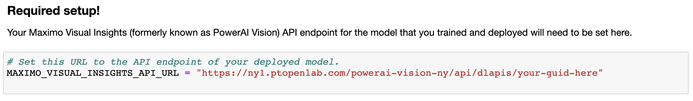

> :exclamation: SuperVessel upgrade is coming :exclamation:
>
>Start Date:  9-Jan-2019 8:00 am EST
>
>End Date:    18-Jan-2019 8:00 am EST (**All data will be deleted**)
>
>
>The hardware and software in NY site will be updated to the latest version, **all users' dataset will be CLEANED.**
>
>**Please back up important data immediately, all data will be permanently deleted after January 18th.** 
>
>If you have any problems after this time frame with regard to connectivity, or if you have any questions regarding the >maintenance at any point, please mail to help@ptopenlab.com .
>
>We appreciate your patience during this work and welcome any feedback.
>
>
>Thank you.
>

# Detect, track, and count cars in a video


Whether you are counting cars on a road or products on a conveyer belt, there are many use cases for computer vision with video. With video as input, automatic labeling can be used to create a better classifier with less manual effort. This Code Pattern shows you how to create and use a classifier to identify objects in motion and then track the objects and count them as they enter designated regions of interest.

In this Code Pattern, we will create a video car counter using PowerAI Vision Video Data Platform, OpenCV and a Jupyter Notebook. We'll use a little manual labeling and a lot of automatic labeling to train an object classifier to recognize cars on a highway. We'll load another car video into a Jupyter Notebook where we'll process the individual frames and annotate the video.

We'll use our deployed model for inference to detect cars on a sample of the frames at a regular interval. We'll use OpenCV to track the cars from frame to frame in between inference. In addition to counting the cars as they are detected, we'll also count them as they cross a "finish line" for each lane and show cars per second.

Credit goes to Michael Hollinger for his initial notebook counting objects with the PowerAI Vision Video Data Platform.

When the reader has completed this Code Pattern, they will understand how to:

* Use automatic labeling to create an object detection classifier from a video
* Process frames of a video using a Jupyter Notebook, OpenCV, and PowerAI Vision
* Detect objects in video frames with PowerAI Vision
* Track objects from frame to frame with OpenCV
* Count objects in motion as they enter a region of interest
* Annotate a video with bounding boxes, labels and statistics


## Flow

1. Upload a video using the PowerAI Vision web UI.
2. Use automatic labeling and train a model.
3. Deploy the model to create a PowerAI Vision inference API.
4. Use a Jupyter Notebook to detect, track, and count cars in a video.

## Included components

* [IBM Power Systems](https://www.ibm.com/it-infrastructure/power): A server built with open technologies and designed for mission-critical applications.
* [IBM Power AI](https://www.ibm.com/us-en/marketplace/deep-learning-platform): A software platform that makes deep learning, machine learning, and AI more accessible and better performing.
* [IBM PowerAI Vision Technology Preview](https://developer.ibm.com/linuxonpower/deep-learning-powerai/technology-previews/powerai-vision/): A complete ecosystem for labeling datasets, training, and deploying deep learning models for computer vision.
* [Jupyter Notebook](https://jupyter.org/): An open source web application that allows you to create and share documents that contain live code, equations, visualizations, and explanatory text.
* [OpenCV](https://opencv.org): Open source computer vision library.
* [Nimbix Cloud Computing Platform](https://www.nimbix.net/): An HPC & Cloud Supercomputing platform enabling engineers, scientists & developers, to build, compute, analyze, and scale simulations in the cloud.

## Featured technologies

* [Artificial Intelligence](https://developer.ibm.com/technologies/artificial-intelligence/): Artificial intelligence can be applied to disparate solution spaces to deliver disruptive technologies.
* [Cloud](https://developer.ibm.com/depmodels/cloud/): Accessing computer and information technology resources through the Internet.
* [Data Science](https://developer.ibm.com/technologies/data-science/): Systems and scientific methods to analyze structured and unstructured data in order to extract knowledge and insights.
* [Mobile](https://mobilefirstplatform.ibmcloud.com/): Systems of engagement are increasingly using mobile technology as the platform for delivery.
* [Python](https://www.python.org/): Python is a programming language that lets you work more quickly and integrate your systems more effectively.

## Watch the Video

[](https://youtu.be/19vaot75JCY)

## Prerequisites

### PowerAI Vision

*This Code Pattern was built with the PowerAI Vision Technology Preview v3.0.*

> NOTE: The steps and examples in this README assume you are using SuperVessel. To download and install the technology preview on-premise instead, refer to [Download PowerAI Vision technology preview](https://developer.ibm.com/linuxonpower/deep-learning-powerai/technology-previews/powerai-vision/).

* To try the preview using the `SuperVessel` cloud, login or register [here](https://ny1.ptopenlab.com/AIVision).

### Jupyter Notebooks

The code included in this Code Pattern runs in a Jupyter Notebook. The notebook itself does not require PowerAI or Power Systems (only access to the deployed API). To run the Jupyter Notebook locally, install it using Anaconda.  The installation instructions are [here](https://jupyter.readthedocs.io/en/latest/install.html).

## Steps

1. [Create a dataset in Video Data Platform](#1-create-a-dataset-in-video-data-platform)
2. [Train and deploy](#2-train-and-deploy)
3. [Automatic labeling](#3-automatic-labeling)
4. [Train and deploy](#4-train-and-deploy)
5. [Run the notebook](#5-run-the-notebook)
6. [Create the annotated video](#6-create-the-annotated-video)

> Hint: If you need a shortcut, you can import the dataset from `data/examples/dataset_auto_labeled.zip`, train and deploy that dataset, and then run the notebook (but you'll get more out of this if you go through all the steps).

### 1. Create a dataset in Video Data Platform

To create a new dataset for object detection training from a video, use PowerAI Video Data Platform and start with a small manually annotated dataset (we'll expand on it with automatic labeling later).

* Download the video to use to train the dataset from [here]( https://ibm.box.com/v/counting-cars-training). Use the `Download` button to create `training_video.mp4` in your browser's Downloads folder.

* Go to [Video Data Platform](https://ny1.ptopenlab.com/video#/) and click on the `DataSet` card.

  

* Click on `Create DataSet`, provide a name and description, and click `Confirm`.

* Use the dataset's operation button `☰` for your dataset and select `Manage Videos` in the drop-down list.

  

* Use the `Upload Video` button to upload the `training_video.mp4` from above.

* Use the video's operation button `☰` and select `Add Label` in the drop-down list.

  

* Type `car` in the `Need More Tag? Input and Press enter...` box and press enter. The `car` tag is then added to the `Tag` drop-down list so you can start tagging cars.

  

* Do manual tagging for at least 5 frames.

  * Keep the `car` tag shown in the `Tag` box.
  * Use the `Capture Frame` camera icon to capture a frame.
  * Drag a bounding box around each car in the frame.
  * Press the `Save` button to save the annotated frame.
  * Click on the video to let it play and then pause on another frame.
  * Capture, tag and save at least 5 frames annotated with at least 25 cars.

  

* Use the breadcrumb to go back to `Video Management`.

  

* Use the video's operation button `☰` and select `Export Labels` in the drop-down list.

  

### 2. Train and deploy

We need to train and deploy the model so that we can use it (for automatic labeling).

* Go to https://ny1.ptopenlab.com/AIVision/index.html#!/datasets. The dataset that you just created by exporting labels should be at the top of the list. Note the timestamp to make sure you know which dataset is the one you just created.

* Click on `My DL Tasks` under My Workspace and then click the `Create New Task` button. Click on `Object Detection`.

* Give the Object Detector a name and make sure your dataset is selected, then click `Build Model`.

  

* A confirmation dialog will give you a time estimate.  Click `Create New Task` to get it started.

* When the model is built, click on `Deploy and Test`.

  

* If/when you want to deploy/redeploy later, just click the `Deploy` button next to your trained model here: https://ny1.ptopenlab.com/AIVision/#!/trained-models.

### 3. Automatic labeling

We use the model that you trained with 5 or more manually annotated frames and use inference to automatically label more cars in your training video.

* Use the sidebar to go back to `Video Data Platform`.

* Use the video's operation button `☰` and select `Auto Labeling` in the drop-down list.

  

* Click on the `Object to detect` drop-down list and select `car`. This API will be available while your car model is deployed.

  

* Use the `Time Interval` drop-down list to select an interval. Use 1 second for our short video.

* Click `Confirm`.

* You can watch the progress as the number under auto label increases and the progress bar shows you the auto labeling progress.

  

* When the task completes, use the video's operation button `☰` and select `Validate` to review the auto labeling.

### 4. Train and deploy

Export the labels again and repeat the above train and deploy process with the newest dataset which was enhanced with automatic labeling.

* Export labels
* Build model
* Deploy

This dataset has many more frames and labeled objects. It will create a much more accurate model.

### 5. Run the notebook

The code included in this Code Pattern runs in a Jupyter Notebook. After you configure the URL of your deployed model in the notebook, you can just run it, read it, and watch the results.

* Start your Jupyter Notebooks. Starting in your `powerai-counting-cars` cloned repo directory will help you find the notebook and the output as described below. Jupyter Notebooks will open in your browser.

   ```bash
   cd powerai-counting-cars
   jupyter notebook
   ```

* Navigate to the `notebooks` directory and open the notebook file named `counting_cars.ipynb` by clicking on it.

  

* Edit the cell below **Required setup!** to replace *your-guid-here* with the ID of your deployed model. If you are not running on SuperVessel, edit the host name too.

  

* Use the drop-down menu `Cell > Run All` to run the notebook, or run the cells one at a time top-down using the play button.

  

* As the cells run, watch the output for results or errors. A running cell will have a label like `In [*]`. A completed cell will have a run sequence number instead of the asterisk.

* The **Test the API on a single frame** cell will demonstrate that you have correctly deployed your inference API. It should output JSON that includes classified cars. A portion of the output would look something like this:

    ```json
      "classified": [
        {
          "confidence": 0.9997443556785583,
          "ymax": 370,
          "label": "car",
          "xmax": 516,
          "xmin": 365,
          "ymin": 240
        }
      ]
    ```

* The **Get object detection results for sampled frames** cell runs inference on a sampling of the video frames. The output will show a progress counter like this:

  

* The **Inference, tracking, and annotation** cell processes every frame and has a similar progress counter. You can also preview the annotated frames as they are created in the `output` directory.

* The **Play the annotated frames in the notebook** cell displays the annotated frames in a loop to demonstrate the new video after they are all created. The notebook animation is usually slower than the video.

### 6. Create the annotated video

You can create an MP4 video from the annotated frames if you have a working installation of [ffmpeg](https://www.ffmpeg.org/). The command is commented out as the last cell of the notebook. You can run it from there, or use the script in `tools/create_video.sh`. The script takes the output directory (with the annotated frames) as an argument like this:

```bash
cd powerai-counting-cars
./tools/create_video.sh notebooks/output
```

> Note: There is also a tool to create a gif from the video. We used that to show the sample output below.

## Sample output

As the notebook cells run, check for errors and watch the progress indicators. After the video has been annotated, the frames will play (like a video) in the notebook. The notebook playback is usually slow. If you used `ffmpeg` to create an annotated video, you can play it back at full speed.

Example annotated video: [here](https://ibm.box.com/v/powerai-vision-counted-cars)

Example notebook with static output: [here](data/examples/example_notebook.ipynb)

Example compressed and converted to gif:


## Troubleshooting

* Stopped adding cars.

  > If you are using the shared SuperVessel environment, your model deployment may be limited to 1 hour. Simply deploy the model again and run the notebook over (or from where the errors started). Using cached results allows the notebook to continue where it left off. To deploy/redeploy the model, just click the `Deploy` button next to your trained model here: https://ny1.ptopenlab.com/AIVision/#!/trained-models.

## Links

* [Computer vision](https://en.wikipedia.org/wiki/Computer_vision): Read about computer vision on Wikipedia.
* [Object detection](https://en.wikipedia.org/wiki/Object_detection): Read about object detection on Wikipedia.
* [Artificial intelligence](https://www.entrepreneur.com/article/283990): Can artificial intelligence identify pictures better than humans?
* [From the developers](https://developer.ibm.com/linuxonpower/2017/08/30/ibm-powerai-vision-speeds-transfer-learning-greater-accuracy-real-world-example/): IBM PowerAI Vision speeds transfer learning with greater accuracy — a real world example.
* [Artificial intelligence and machine learning](https://developer.ibm.com/technologies/artificial-intelligence/): Build artificial intelligence functions into your app.

## Learn more

* **Artificial Intelligence Code Patterns**: Enjoyed this Code Pattern? Check out our other [AI Code Patterns](https://developer.ibm.com/technologies/artificial-intelligence/).
* **AI and Data Code Pattern Playlist**: Bookmark our [playlist](https://www.youtube.com/playlist?list=PLzUbsvIyrNfknNewObx5N7uGZ5FKH0Fde) with all of our Code Pattern videos
* **PowerAI**: Get started or get scaling, faster, with a software distribution for machine learning running on the Enterprise Platform for AI: [IBM Power Systems](https://www.ibm.com/us-en/marketplace/deep-learning-platform)

## License

This code pattern is licensed under the Apache License, Version 2. Separate third-party code objects invoked within this code pattern are licensed by their respective providers pursuant to their own separate licenses. Contributions are subject to the [Developer Certificate of Origin, Version 1.1](https://developercertificate.org/) and the [Apache License, Version 2](https://www.apache.org/licenses/LICENSE-2.0.txt).
