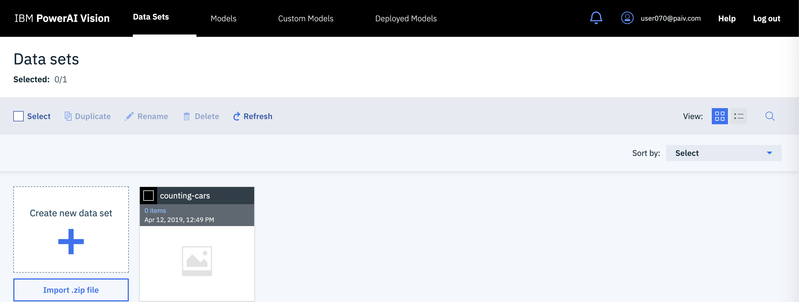
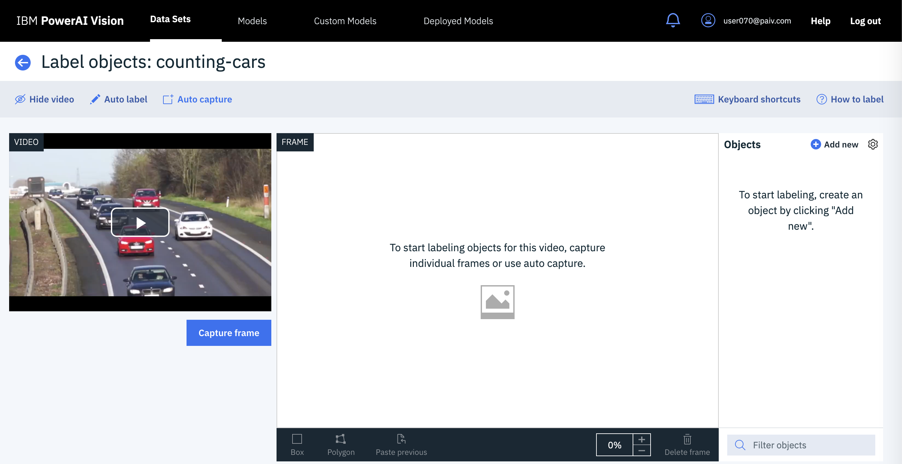

# Detect, track, and count cars in a video


**Note: This repo has been updated to use Maximo Visual Inspection (formerly known as PowerAI Vision). Everything is the same except for the name itself.**

Whether you are counting cars on a road or products on a conveyer belt, there are many use cases for computer vision with video. With video as input, automatic labeling can be used to create a better classifier with less manual effort. This code pattern shows you how to create and use a classifier to identify objects in motion and then track the objects and count them as they enter designated regions of interest.

In this code pattern, we will create a video car counter using Maximo Visual Inspection, OpenCV and a Jupyter Notebook. We'll use a little manual labeling and a lot of automatic labeling to train an object classifier to recognize cars on a highway. We'll load another car video into a Jupyter Notebook where we'll process the individual frames and annotate the video.

We'll use our deployed model for inference to detect cars on a sample of the frames at a regular interval. We'll use OpenCV to track the cars from frame to frame in between inference. In addition to counting the cars as they are detected, we'll also count them as they cross a "finish line" for each lane and show cars per second.

Credit goes to Michael Hollinger for his initial notebook counting objects with PowerAI Vision.

When the reader has completed this code pattern, they will understand how to:

* Use automatic labeling to create an object detection classifier from a video
* Process frames of a video using a Jupyter Notebook, OpenCV, and Maximo Visual Inspection (formerly known as PowerAI Vision)
* Detect objects in video frames with Maximo Visual Inspection
* Track objects from frame to frame with OpenCV
* Count objects in motion as they enter a region of interest
* Annotate a video with bounding boxes, labels and statistics


## Flow

1. Upload a video using the Maximo Visual Inspection web UI.
2. Use automatic labeling and train a model.
3. Deploy the model to create a Maximo Visual Inspection (formerly known as PowerAI Vision) inference API.
4. Use a Jupyter Notebook to detect, track, and count cars in a video.

## Included components

* [IBM Maximo Visual Inspection](https://www.ibm.com/products/ibm-maximo-visual-inspection): Rapidly unleash the power of computer vision for inspection automation without deep learning expertise.
* [Jupyter Notebook](https://jupyter.org/): An open source web application that allows you to create and share documents that contain live code, equations, visualizations, and explanatory text.
* [OpenCV](https://opencv.org): Open source computer vision library.

## Featured technologies

* [Artificial Intelligence](https://developer.ibm.com/technologies/artificial-intelligence/): Artificial intelligence can be applied to disparate solution spaces to deliver disruptive technologies.
* [Cloud](https://developer.ibm.com/depmodels/cloud/): Accessing computer and information technology resources through the Internet.
* [Data Science](https://developer.ibm.com/technologies/data-science/): Systems and scientific methods to analyze structured and unstructured data in order to extract knowledge and insights.
* [Mobile](https://mobilefirstplatform.ibmcloud.com/): Systems of engagement are increasingly using mobile technology as the platform for delivery.
* [Python](https://www.python.org/): Python is a programming language that lets you work more quickly and integrate your systems more effectively.

## Watch the Video

[](https://youtu.be/19vaot75JCY)

## Prerequisites

### PowerAI Vision

This code pattern requires Maximo Visual Inspection (formerly known as PowerAI Vision).

Go [here](https://www.ibm.com/support/pages/ibm-maximo-visual-inspection)
to learn more about trial access (Scroll down to the `Give it a try` section).

*This code pattern has been updated with screenshots and instructions for PowerAI Vision 1.1.3, but the instructions are the same for IBM Maximo Visual Insights.*

### Jupyter Notebooks

The code included in this code pattern runs in a Jupyter Notebook. The notebook itself does not require Maximo Visual Inspection or Power Systems (only access to the deployed API). To run the Jupyter Notebook locally, install it using Anaconda.  The installation instructions are [here](https://jupyter.readthedocs.io/en/latest/install.html).

## Steps

1. [Create a dataset in Maximo Visual Inspection](#1-create-a-dataset-in-maximo-visual-inspection)
2. [Train and deploy](#2-train-and-deploy)
3. [Automatic labeling](#3-automatic-labeling)
4. [Train and deploy](#4-train-and-deploy)
5. [Run the notebook](#5-run-the-notebook)
6. [Create the annotated video](#6-create-the-annotated-video)

> Hint: If you need a shortcut, you can import the dataset from `data/examples/dataset_auto_labeled.zip`, train and deploy that dataset, and then run the notebook (but you'll get more out of this if you go through all the steps).

### 1. Create a dataset in Maximo Visual Inspection

To create a new dataset for object detection training from a video, use the Maximo Visual Inspection  UI and start with a small manually annotated dataset (we'll expand on it with automatic labeling later).

* Download the video to use to train the dataset from [here](https://raw.githubusercontent.com/IBM/powerai-counting-cars/master/data/training_video.mp4). Use the `Download` button to create `training_video.mp4` in your browser's Downloads folder.

* Click on the `Data Sets` tab.
* Click on the `Create new data set` card.
* Provide a data set name.
* Click the `Create` button.
* Click on the newly created data set card.

  

* Click on `Import files` and open your downloaded `training_video.mp4` file.

* Select the new uncategorized card and click the `Label objects` button.

  

* Click on `Auto capture`, set the capture interval to 5 seconds, and click the `Auto capture` button.

  

  > Tips!  Click on `How to label` for more detailed labeling tips.

* Create a new object label for the data set by clicking `+ Add new` by the `Objects` list. For example, add a `car` object label.

* Label the objects in the frames by following these steps.
  * Select a frame in the carousel.
  * Select the correct object label.
  * Choose `Box` from the bottom left.
  * Draw a box around each car in each captured frame.

  

### 2. Train and deploy

#### Train the model

* Go back to the data set page and click `Train model`.
* Select `Object detection`.
* Review the `Advanced` settings. You can train faster (with less accuracy) by reducing the max iterations.
* Click `Train`.

#### Deploy the model

* Go to the `Models` tab.
* Click the `Deploy model` button.
* Use the `Deployed Models` tab to see the status.
* When the status is ready, click on the deployed model to get the API endpoint.

### 3. Automatic labeling

We use the first deployed model that you trained with manually annotated frames and use inference to automatically label more cars in your training video.

* Go back to the data set.
* Select your video card.
* Click the `Label objects` button.
* Click on `Auto label`.
* Enter 1 for `Capture Interval (Seconds)`.
* Select your deployed model.
* Click the `Auto label` button.

Frames are captured at the specified interval and labels are added by using the specified trained model. By default, the automatically added labels are light red.
After processing, you can manually add labels to the frames that have been auto labeled and you can manipulate (move, resize) the labels that were automatically generated. If a frame with automatically generated labels is edited, all labels on the frame are converted to manual labels.

### 4. Train and deploy

Repeat the above train and deploy process with the newest dataset which was enhanced with automatic labeling.

* Train model
* Deploy model

This dataset has many more frames and labeled objects. It will create a much more accurate model.

### 5. Run the notebook

The code included in this code pattern runs in a Jupyter Notebook. After you configure the URL of your deployed model in the notebook, you can just run it, read it, and watch the results.

* Start your Jupyter Notebooks. Starting in your `powerai-counting-cars` cloned repo directory will help you find the notebook and the output as described below. Jupyter Notebooks will open in your browser.

   ```bash
   cd powerai-counting-cars
   jupyter notebook
   ```

* Navigate to the `notebooks` directory and open the notebook file named `counting_cars.ipynb` by clicking on it.

  

* Edit the cell below **Required setup!** to replace the URL with the API endpoint of your deployed model. Use the copy button to capture the whole URL.

  

* Use the drop-down menu `Cell > Run All` to run the notebook, or run the cells one at a time top-down using the play button.

  

* As the cells run, watch the output for results or errors. A running cell will have a label like `In [*]`. A completed cell will have a run sequence number instead of the asterisk.

* The **Test the API on a single frame** cell will demonstrate that you have correctly deployed your inference API. It should output JSON that includes classified cars. A portion of the output would look something like this:

    ```json
      "classified": [
        {
          "confidence": 0.9997443556785583,
          "ymax": 370,
          "label": "car",
          "xmax": 516,
          "xmin": 365,
          "ymin": 240
        }
      ]
    ```

* The **Get object detection results for sampled frames** cell runs inference on a sampling of the video frames. The output will show a progress counter like this:

  

* The **Inference, tracking, and annotation** cell processes every frame and has a similar progress counter. You can also preview the annotated frames as they are created in the `output` directory.

* The **Play the annotated frames in the notebook** cell displays the annotated frames in a loop to demonstrate the new video after they are all created. The notebook animation is usually slower than the video.

### 6. Create the annotated video

You can create an MP4 video from the annotated frames if you have a working installation of [ffmpeg](https://www.ffmpeg.org/). The command is commented out as the last cell of the notebook. You can run it from there, or use the script in `tools/create_video.sh`. The script takes the output directory (with the annotated frames) as an argument like this:

```bash
cd powerai-counting-cars
./tools/create_video.sh notebooks/output
```

> Note: There is also a tool to create a gif from the video. We used that to show the sample output below.

## Sample output

As the notebook cells run, check for errors and watch the progress indicators. After the video has been annotated, the frames will play (like a video) in the notebook. The notebook playback is usually slow. If you used `ffmpeg` to create an annotated video, you can play it back at full speed.

Example annotated video: [here](https://ibm.box.com/v/powerai-vision-counted-cars)

Example notebook with static output: [here](data/examples/example_notebook.ipynb)

Example compressed and converted to gif:


## Troubleshooting

* Stopped adding cars.

  > If you are using a trial environment, your model deployment may be limited to 1 hour. Simply deploy the model again and run the notebook over (or from where the errors started). Using cached results allows the notebook to continue where it left off.

## Links

* [Maximo Visual Inspection Learning Path](https://developer.ibm.com/technologies/vision/series/learning-path-powerai-vision/): From computer vision basics to creating your own apps.
* [Maximo Visual Inspection Object Detection](https://github.com/IBM/powerai-vision-object-detection): use Maximo Visual Insights Object Detection to detect and label objects, within an image, based on customized training.
* [Computer vision](https://en.wikipedia.org/wiki/Computer_vision): Read about computer vision on Wikipedia.
* [Object detection](https://en.wikipedia.org/wiki/Object_detection): Read about object detection on Wikipedia.
* [Artificial intelligence](https://www.entrepreneur.com/article/283990): Can artificial intelligence identify pictures better than humans?
* [Artificial intelligence and machine learning](https://developer.ibm.com/technologies/artificial-intelligence/): Build artificial intelligence functions into your app.

## Learn more

* **Artificial intelligence code patterns**: Enjoyed this code pattern? Check out our other [AI code patterns](https://developer.ibm.com/technologies/artificial-intelligence/).
* **AI and data code pattern playlist**: Bookmark our [playlist](https://www.youtube.com/playlist?list=PLzUbsvIyrNfknNewObx5N7uGZ5FKH0Fde) with all of our code pattern videos
* **PowerAI**: Get started or get scaling, faster, with a software distribution for machine learning running on the Enterprise Platform for AI: [IBM Power Systems](https://www.ibm.com/us-en/marketplace/deep-learning-platform)

## License

This code pattern is licensed under the Apache License, Version 2. Separate third-party code objects invoked within this code pattern are licensed by their respective providers pursuant to their own separate licenses. Contributions are subject to the [Developer Certificate of Origin, Version 1.1](https://developercertificate.org/) and the [Apache License, Version 2](https://www.apache.org/licenses/LICENSE-2.0.txt).
