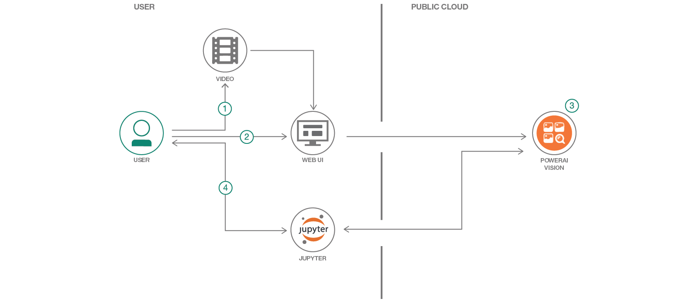

# Detect, track, and count cars in a video

Whether you are counting cars on a road or products on a conveyer belt, there are many use cases for computer vision with video. With video as input, auto-labeling can be used to create a better classifier with less manual effort. This Code Pattern shows you how to create and use a classifier to identify objects in motion and then track the objects and count them as they enter designated regions of interest. 

In this Code Pattern, we will create a video car counter using PowerAI Vision Video Data Platform, OpenCV and a Jupyter Notebook. We'll use a little manual labeling and a lot of auto-labeling to train an object classifier to recognize cars on a highway. We'll load another car video into a Jupyter Notebook where we'll process the individual frames and annotate the video.

We'll use our deployed model for inference to detect cars on a sample of the frames at a regular interval. We'll use OpenCV to track the cars from frame to frame in between inference. In addition to counting the cars as they are detected, we'll also count them as they cross a "finish line" for each lane and show cars per second.

Credit goes to Michael Hollinger for his initial notebook counting objects with the PowerAI Vision Video Data Platform.

When the reader has completed this Code Pattern, they will understand how to:

* Use auto-labeling to create an object detection classifier from a video
* Process frames of a video using a Jupyter Notebook, OpenCV, and PowerAI Vision
* Detect objects in video frames with PowerAI Vision
* Track objects from frame to frame with OpenCV
* Count objects in motion as they enter a region of interest
* Annotate a video with bounding boxes, labels and statistics

## Flow
1. Upload a video using the PowerAI Vision web UI.
2. Use auto-labeling and train a model.
3. Deploy the model to create a PowerAI Vision inference API.
4. Use a Jupyter Notebook to detect, track, and count cars in a video.

## Included components
* [IBM Power Systems](https://www-03.ibm.com/systems/power/): A server built with open technologies and designed for mission-critical applications.
* [IBM Power AI](https://www.ibm.com/ms-en/marketplace/deep-learning-platform): A software platform that makes deep learning, machine learning, and AI more accessible and better performing.
* [IBM PowerAI Vision Technology Preview](https://developer.ibm.com/linuxonpower/deep-learning-powerai/technology-previews/powerai-vision/): A complete ecosystem for labeling datasets, training, and deploying deep learning models for computer vision.
* [Jupyter Notebook](http://jupyter.org/): An open source web application that allows you to create and share documents that contain live code, equations, visualizations, and explanatory text.
* [OpenCV](https://opencv.org): Open source computer vision library.
* [Nimbix Cloud Computing Platform](https://www.nimbix.net/): An HPC & Cloud Supercomputing platform enabling engineers, scientists & developers, to build, compute, analyze, and scale simulations in the cloud.

## Featured technologies
* [Artificial Intelligence](https://medium.com/ibm-data-science-experience): Artificial intelligence can be applied to disparate solution spaces to deliver disruptive technologies.
* [Cloud](https://www.ibm.com/developerworks/learn/cloud/): Accessing computer and information technology resources through the Internet.
* [Data Science](https://medium.com/ibm-data-science-experience/): Systems and scientific methods to analyze structured and unstructured data in order to extract knowledge and insights.
* [Mobile](https://mobilefirstplatform.ibmcloud.com/): Systems of engagement are increasingly using mobile technology as the platform for delivery.
* [Python](https://www.python.org/): Python is a programming language that lets you work more quickly and integrate your systems more effectively.

<!--
# Watch the Video

-->

# Sample output

As the notebook cells run, check for errors and watch the progress indicators. After the video has been annotated, the frames will play (like a video) in the notebook. The notebook playback is usually slow.

Use the ffmpeg command provided in the last notebook cell to create an MP4 video from the frames for a higher quality, full speed playback.

Example annotated video: https://ibm.ent.box.com/file/290363697690

Example compressed and converted to gif:

 

# Links
* [Computer vision](https://en.wikipedia.org/wiki/Computer_vision): Read about computer vision on Wikipedia.
* [Object detection](https://en.wikipedia.org/wiki/Object_detection): Read about object detection on Wikipedia.
* [Artificial intelligence](https://www.entrepreneur.com/article/283990): Can artificial intelligence identify pictures better than humans?
* [From the developers](https://developer.ibm.com/linuxonpower/2017/08/30/ibm-powerai-vision-speeds-transfer-learning-greater-accuracy-real-world-example/): IBM PowerAI Vision speeds transfer learning with greater accuracy — a real world example.
* [Artificial intelligence and machine learning](https://developer.ibm.com/ai/): Build artificial intelligence functions into your app.

# Learn more
* **Artificial Intelligence Code Patterns**: Enjoyed this Code Pattern? Check out our other [AI Code Patterns](https://developer.ibm.com/code/technologies/artificial-intelligence/).
* **AI and Data Code Pattern Playlist**: Bookmark our [playlist](https://www.youtube.com/playlist?list=PLzUbsvIyrNfknNewObx5N7uGZ5FKH0Fde) with all of our Code Pattern videos
* **PowerAI**: Get started or get scaling, faster, with a software distribution for machine learning running on the Enterprise Platform for AI: [IBM Power Systems](https://www.ibm.com/ms-en/marketplace/deep-learning-platform)

# License
[Apache 2.0](LICENSE)

